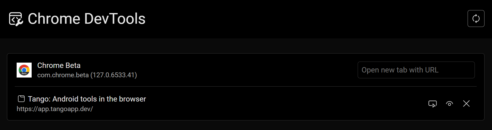
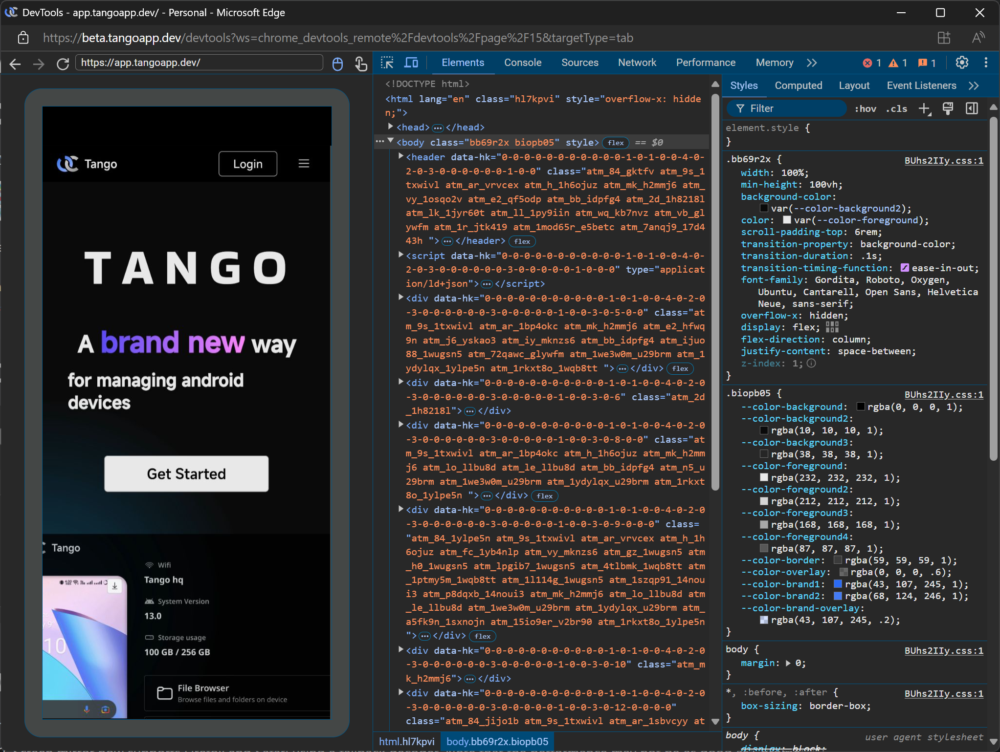

# Version 1.4: Sign in with Alipay and return of Chrome Remote Debugger

<head>
  <meta name="fediverse:creator" content="@yumechan@mastodon.social"/>
</head>

We are happy to announce that we have added a new sign-in method: Alipay. Now, you can sign in to Tango with your Alipay account.

Chrome Remote Debugger allows you to debug web pages on your Android device from your PC. It's a powerful tool for web developers. It was in the old demo but not in the new app, now it's back with a fresh look.

{/* truncate */}

## Chrome Remote Debugger

The Chrome Remote Debugger (Chrome DevTools) feature has been added back to Tango. It now supports the latest version of Chrome for Android using latest version of Chrome DevTools Frontend.

This feature is basically same as `chrome://inspect` page in Chrome. It first lists all supported browsers and WebViews on the device, then opens a new window for debugging the selected target.

Currently there are two limitations:

1. It doesn't work offline, because Chrome DevTools Frontend has around 2800 files across 45MB compressed. It's not impossible to cache them all, but it will take a lot of time and storage.
2. It doesn't work on mobile devices because of the lack of cross-tab communication. We are looking for a solution for this.

We also discovered several issues with Chrome itself when integrating the debugger. We have reported them to the Chrome team and are waiting for their response.

## Other changes

1. The sign-in page now becomes a popup dialog, it's more user-friendly and easier to use.
2. Screen mirror now supports Firefox and Safari using a fallback decoder. Note that the performance may not be as good as Chrome.

## End Note

Remember to join our [Discord server](https://discord.gg/26k3ttC2PN) to get the latest news, check the public roadmap, and let us know your feedback. We are looking forward to hearing from you!
