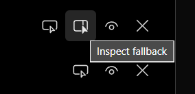
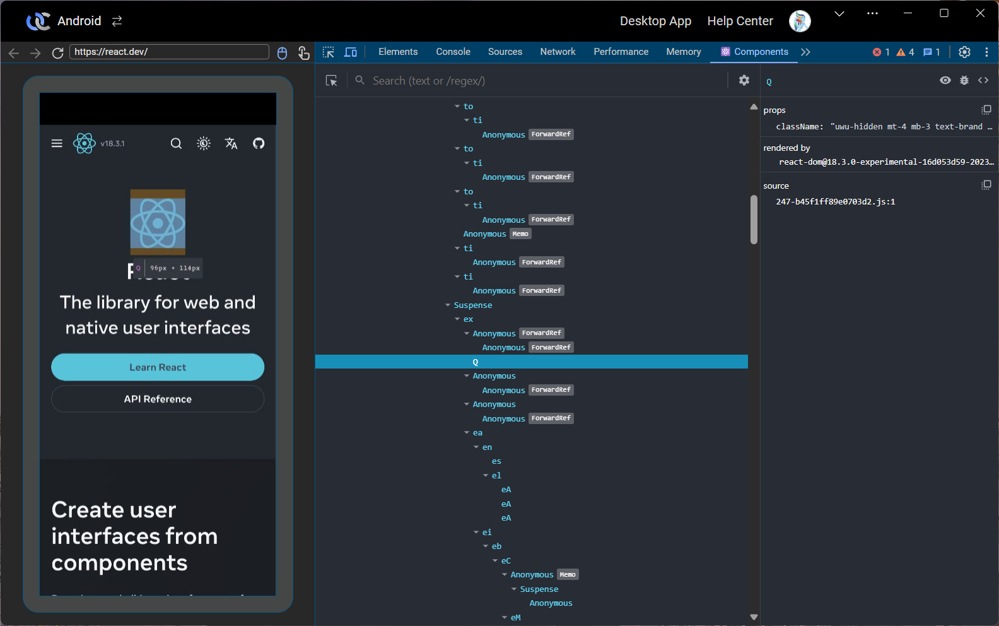

# Version 1.4.1: Improvements on Chrome DevTools and bugfixes

<head>
  <meta name="fediverse:creator" content="@yumechan@mastodon.social">
</head>

Hello everyone! This is a small update to improve the Chrome DevTools feature and fix some bugs:

{/* truncate */}

## Chrome Remote Debugger

In version 1.4.0, we introduced the Chrome DevTools feature. We have received some feedback and suggestions from the community, and we have made some improvements:

1. It now works on mobile device. The difference is that it navigates the current tab, instead of opening a new window like on desktop.
2. Improved the connection stability by letting the Chrome DevTools page connect to the device directly. This however will take a bit longer to initialize.
1. The target list now shows Browser apps without any tabs opened. You can open a new tab in it from the list.
2. Improved performance by enabling data compression.

Due to a bug in recent versions of Chrome, some pages may not work when inspected. We have added a **Inspect fallback** button that uses a different method to connect to the page.

  

Sometimes one tab will be shown twice in the list, one with the **Inspect fallback** button and one without. The **Inspect** button on the one without the fallback button should be tried first.

## Add support for React DevTools

We have integrated the React DevTools extension into our Chrome DevTools. On web pages that are built with React, you can now inspect the React components including their props and states.

Due to how the React DevTools extension works, you need to open the Chrome DevTools page first, then refresh the page you want to inspect. But to our knowledge, this is the simplest way to inspect React components on a mobile device!

If you want to see other DevTools extensions integrated, please let us know!

## Bugfixes

1. Fixed downloading multiple files or folders in File Browser doesn't work.
2. Fixed all popups in Terminal page are not clickable.

## End Note

Remember to join our [Discord server](https://discord.gg/26k3ttC2PN) to get the latest news, check the public roadmap, and let us know your feedback. We are looking forward to hearing from you!
