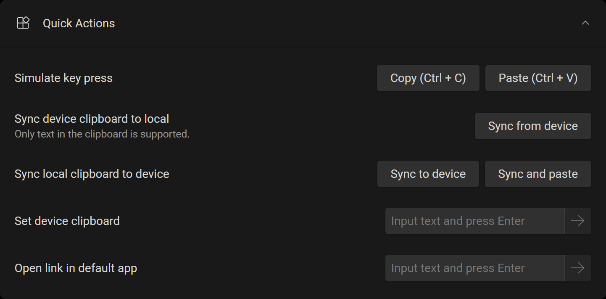

# Version 1.7: Quick Actions

<head>
  <meta name="fediverse:creator" content="@yumechan@mastodon.social"/>
</head>

It has been a while since we last added features to Tango. But today is the day Quick Actions arrive.

Originally requested in GitHub issue [#617](https://github.com/yume-chan/ya-webadb/issues/617) and [#619](https://github.com/yume-chan/ya-webadb/issues/619), Quick Actions includes two features: two-way clipboard synchronization and open links in browser or associated app. It helps you to quickly transfer data between your device and your computer.

{/* truncate */}

## Quick Actions

On the **Overview** page, you can find the new expandable **Quick Actions** section. This feature is available to all plans.

### Simulate key press

Press **Copy** and **Paste** keyboard shortcuts on the device, to copy selected text or paste device clipboard content into the current input field.

### Sync device clipboard to local

The **Sync from device** button reads content of the device's clipboard and write it into the computer's clipboard.

### Sync local clipboard to device

On opposite, the **Sync to device** button reads content of the computer's clipboard and write it into the device's clipboard.

In addition, the **Sync and paste** button also simulates a **Paste** keyboard shortcut on the device, to essentially paste the computer's clipboard content into the current input field on device.

### Set device clipboard

It provides another way to set device clipboard, by simply typing in the input box.

[#617](https://github.com/yume-chan/ya-webadb/issues/617) originally requested for direct text input, however, Android only provides API to input ASCII characters, and that API doesn't work when non-English IME (Input Method Editors) is active, so we decided to use the clipboard instead.

### Open link in default app

Open a link in the default app on the device.

For `https://` links, if some app (e.g. YouTube) has been registered to handle the link (e.g. a YouTube video link), the app will be opened, otherwise the link will be opened in the default browser.

Other apps might also register their own scheme handler (e.g. `my-scheme://` instead of common `https://`), you can also open them using this feature.

## End Note

We are happy to add more convenient features for all users, and we hope you can enjoy the new features :heart:.

If you have any suggestions or feedback, please let us know through [GitHub](https://github.com/tango-adb/feedback/issues) or our [Discord Server](https://discord.gg/26k3ttC2PN)!
