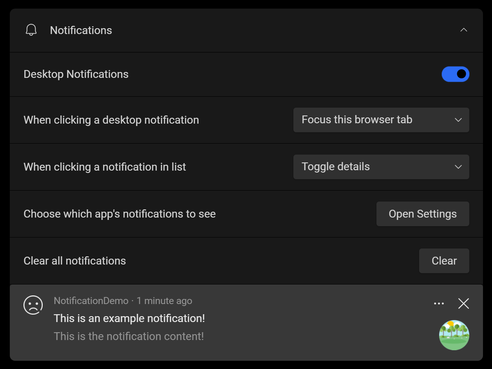
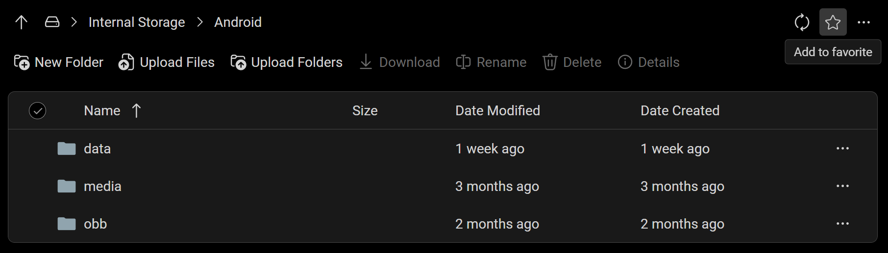
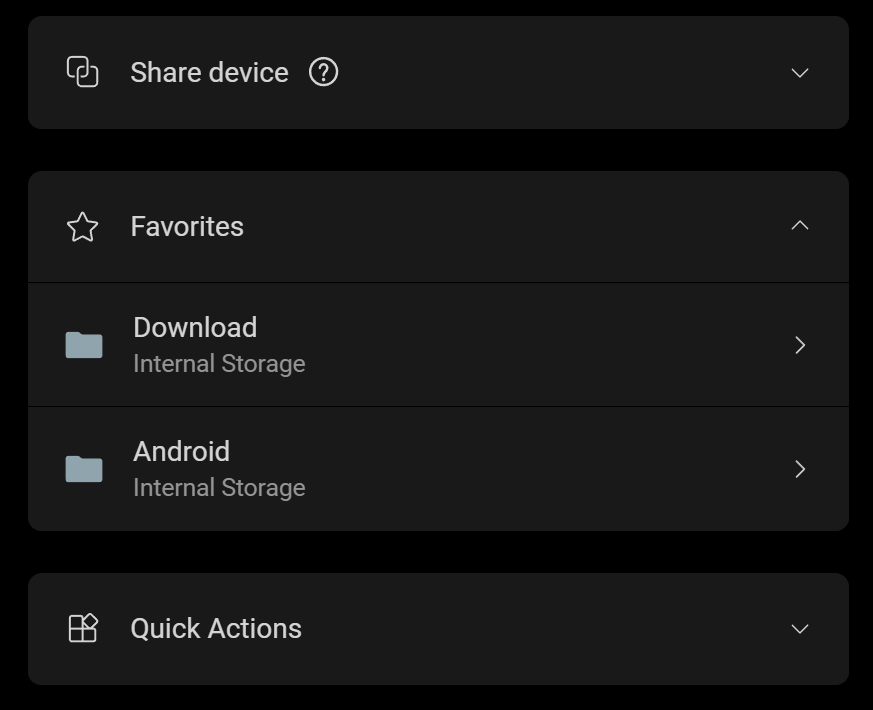
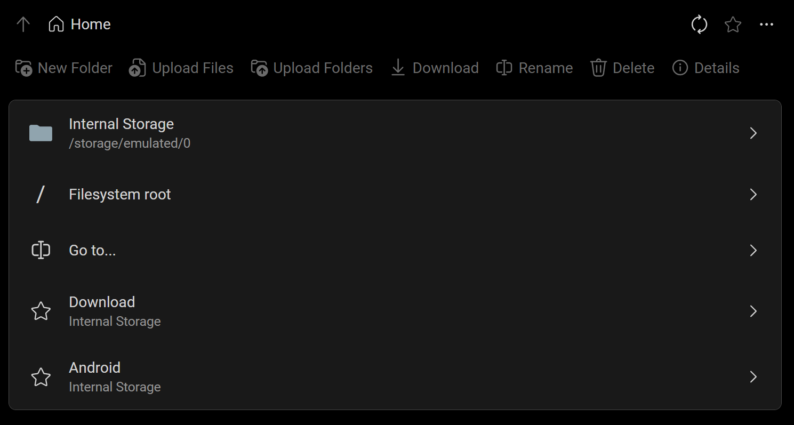

# Version 1.8: Notifications and Favorites

<head>
  <meta name="fediverse:creator" content="@yumechan@mastodon.social"/>
</head>

Greetings everyone! Today, we are happy to announce that we have added two new features to the app:

1. Notification forwarding: You can now see and interact with notifications from the device.
2. Favorites: You can now add and manage your favorite folders on the device.

{/* truncate */}

## See and interact with notifications from the device

This is a highly requested feature, and we are happy to announce that it is finally available.

Now with the Notifications section on the Overview page, you can:

* See your device's notifications in the app.
* If desktop notifications are enabled, you will also see them in your operating system's notification center even when the app is in the background.
* (On Android 11 and later) Tap on a notification to open it on the device, and optionally start screen mirroring.
* Dismiss one or all notifications from the device.

If you don't want to see notifications from a specific app, you can disable them in the "Choose which app's notifications to see" option. However, this won't disable this app's notifications on the device.

Android's notifications can have multiple styles, such as images, actions, and input boxes. We should support all basic styles, but if you think a notification is not displayed correctly, please let us know through [GitHub](https://github.com/tango-adb/feedback/issues) or our [Discord Server](https://discord.gg/26k3ttC2PN)!

## Open your favorite folders faster

Do you need to access certain folders on the device frequently? With the new Favorites feature, you can add links to them to access them even quicker.

New Favorites section on Overview page (shown after adding a favorite):

The File Browser home page also has been redesigned to help you start quicker.

Your favorites are saved on the device itself, so there are persisted when you plug in your device on another computer. If you have multiple devices, each device will have its own set of favorites.
