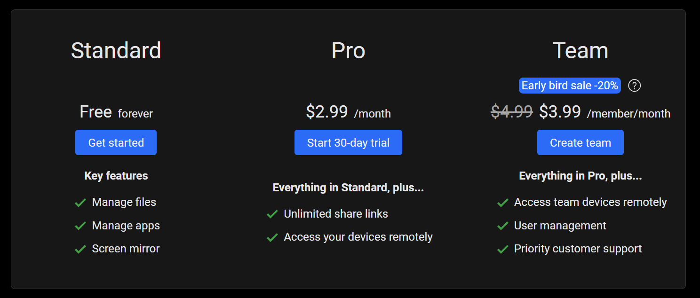

# Version 2.0: Team plan

<head>
  <meta name="fediverse:creator" content="@yumechan@mastodon.social">
</head>

Hello everyone!

After the long waiting, the team plan (previously organization plan) is finally here. Comparing to Pro plan, team plan offers automatic device sharing across the whole team, so it's better suited for small team with device sharing requirements.

{/* truncate */}

The pricing is **$4.99 / member / month** or **$53.88 / member / year**, but to thank everyone's support, we decided to give another **20% special discount for early adopters** (before Jun 1st, 2025), make it **$3.99 / member / month** or **$43.08 / member / year**. Team created in this period can keep this price **after the sale ends**, and also **for future members**.

To learn how to create and manage your team, check our support page at https://help.tangoapp.dev/team/create-team/. You can start creating your team at https://app.tangoapp.dev/pricing

For any questions, you can contact us on [Discord](https://discord.gg/26k3ttC2PN)!
