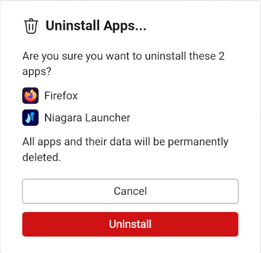

# App Manager

App manager lists installed apps on device.

## Filters

There are several filters to help you find the app you want:

* **System App**: show only system apps or third-party apps. System apps are the apps that come with the device and can't be uninstalled.
* **Can be launched**: whether the app has a main activity that can be launched. Apps that can be launched are usually the ones you can see on your home screen or app drawer.
* **Allow backup**: whether the app supports the legacy backup feature. Most apps don't support backup, and this filter is only useful for a few apps.
* **Split APK**: whether the app uses split APKs. This will affect the behavior of the **Export APK** function.

Each filter has three options:

* **Not Matter**: the filter is not applied. All apps will be shown.
* **Yes**: only apps that match the filter will be shown.
* **No**: only apps that don't match the filter will be shown.

If multiple filters are in **Yes** or **No** state, only apps that match (or not match) all filters will be shown.

## Install APK

If you have an APK file on your computer, you can install it on the device by clicking the **Install APK** button.

You can also install split APKs, including `.apks`, `.xapk`, and `.apkm` files.

## Command bar

The command bar has the following buttons:

### Uninstall

Uninstall the selected apps. You can select multiple apps using the checkboxes on the left side.

System apps can't be uninstalled.

### Backup

Create a backup of the selected apps.

App Backup is a deprecated feature, and most apps can't be backed up. For apps that allow backup, the backup file will contain the app's data, settings, and optionally the APK file.

A confirmation dialog will be shown on device before the backup starts.

The created backup file can be restored using the **Restore Backup** button.

Tango doesn't support creating backups with password protection.

### Export APK

Export the APK file of the selected apps. The exported APK file can be installed on other devices.

If the app uses split APKs, the exported file will be a `.apks` file including all installed features.

If multiple apps are selected, the exported file will be a ZIP file containing all APKs.

### Details

Show details of the selected app. Including a breakdown of the app's storage usage.
