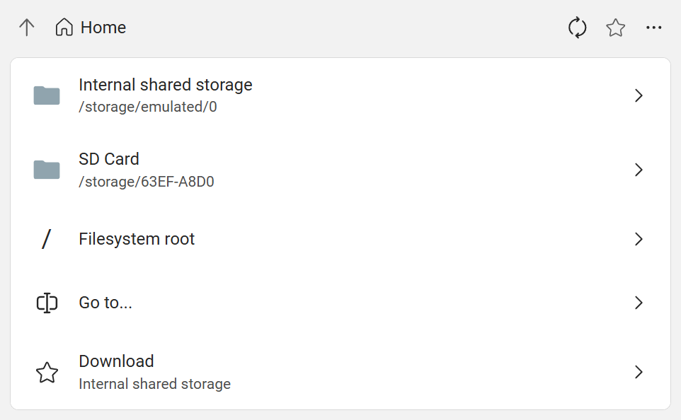
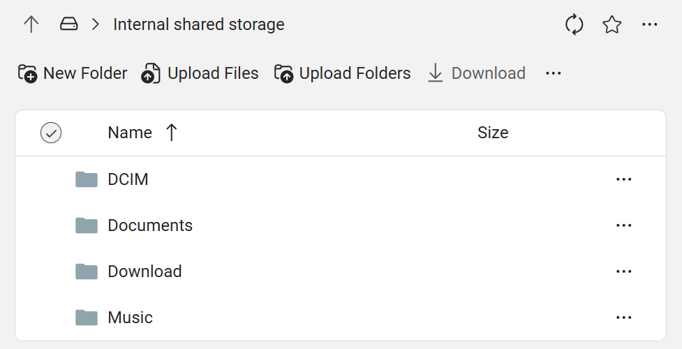

# File Browser

File browser page allows you to browse files and folders on your device. You can also create, rename, delete, upload, download files and folders.

## Home view

When you open the file browser, it displays the Home page.

The Home page includes:

### Volumes

Volumes are physical storage devices:

* Internal storage (shows their localized names)
* SD cards (shows their volume names)
* USB drives (shows their model names)

### Advanced options

* **Filesystem root**: Open Linux's root folder. For advanced users only.
* **Go to...**: Open the input path directly.

### Favorites

If you have [added some folders as favorites](#add-folders-to-favorites), they will be displayed here for quick access.

## Folder view

When you tap on an item on the Home page, it will switch to the folder view. This view displays files and sub-folders in current folder.

### Command bar

The command bar has the following buttons:

* **New folder**: create a new folder here. To create nested folders, you can include `/` in the folder name.
* **Upload**: upload files to this folder. Multiple files can be selected at once.
* **Download**: download selected files and folders. If multiple files or a folder is selected, they will be downloaded as a zip file.
* **Rename**: rename the selected item.
* **Delete**: permanently delete the selected items. There will be a confirmation dialog before deleting. Deleted files can't be recovered.
* **Details**: show details of the selected item.

### Files and folders

Tap on a folder will open it. Tap on a file will not do anything, you need to download and open it on your computer.

Tap the checkbox to select it to enable options in the command bar.

Tap <svg xmlns="http://www.w3.org/2000/svg" width="28" height="28" style={{verticalAlign:"middle"}} viewBox="0 0 16 16"><path d="M4 7a1 1 0 1 1 0 2a1 1 0 0 1 0-2zm4 0a1 1 0 1 1 0 2a1 1 0 0 1 0-2zm4 0a1 1 0 1 1 0 2a1 1 0 0 1 0-2z" fill="currentColor" fill-rule="nonzero"/></svg> button on the right to open the menu for this item. The menu has the same options as the command bar.

## Add folders to favorites

Folders can be added to favorites for quick access. Your favorites will be displayed both on the [Overview page](./overview.mdx) and the [Home view](#home-view).

import FluentStar20Regular from '~icons/fluent/star-20-regular';

To do this, open the folder you want to add to favorites, then tap the <FluentStar20Regular/> button.

To remove a folder from favorites, tap the <FluentStar20Regular/> button again.

## Create a bookmark for a folder

The page's URL contains serial number of the device and path of the current folder. You can bookmark/favorite it in your browser to quickly open the folder next time.
