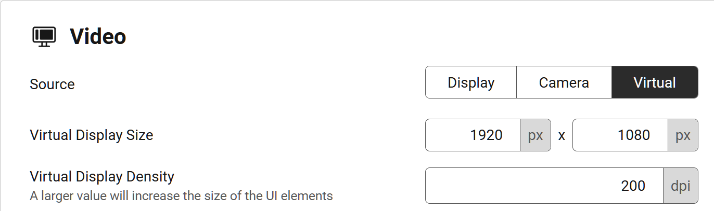

# Create and mirror virtual display

import Pro from '../../_pro.tsx';

<Pro/>

Android devices support connecting multiple displays via USB-C or Miracast, each display can show different content and accept touch input independently, allowing you to use multiple apps at the same time.

On Android 11 and higher, Tango can create and mirror virtual displays, which is very similar to connecting a physical display to the device.

To mirror a virtual display, scroll to **Video** section, then change **Source** to **Virtual**.  You can also customize the resolution and density of the virtual display below.

## App launcher and app switcher

On Android 13 and lower, due to system restrictions, your default app launcher and app switcher will not work on virtual displays. Instead, Tango provides a simple app launcher and app switcher for you.

import Circle from './circle.svg';

The app launcher should open automatically when there is no app running on the virtual display. You can also open it by tapping the <Circle /> button in the command bar.

To hide the app launcher, tap the <Circle /> button in the command bar.

The [app switcher](./control.mdx#app-switcher) on the left side will only include apps running on the current virtual display. You can switch between apps by tapping on the app icons.

## Show PowerPoint presentation on virtual displays

Android system has a feature that allows apps to show different contents on multiple screens. For example, in Microsoft Office app, starting a PowerPoint presentation will show the presentation in full screen on the second screen, while the main screen shows the controls.

This feature also works on virtual displays. If Tango is mirroring a virtual display, these apps can show their contents on the virtual display.

If the app launcher is showing on the virtual display and covering the content, you can tap the <Circle /> button in the command bar to hide it.

## Create multiple virtual displays

On Desktop platforms, it's possible to create and mirror multiple virtual displays by opening multiple tabs of Tango. Each virtual display is independent and can run different apps. Note that one Android app can't have multiple instances on different displays, opening an app on one virtual display will close it on other displays.

If the device is shared using a link or Remote Access, each sharing session will also create its own virtual display.
