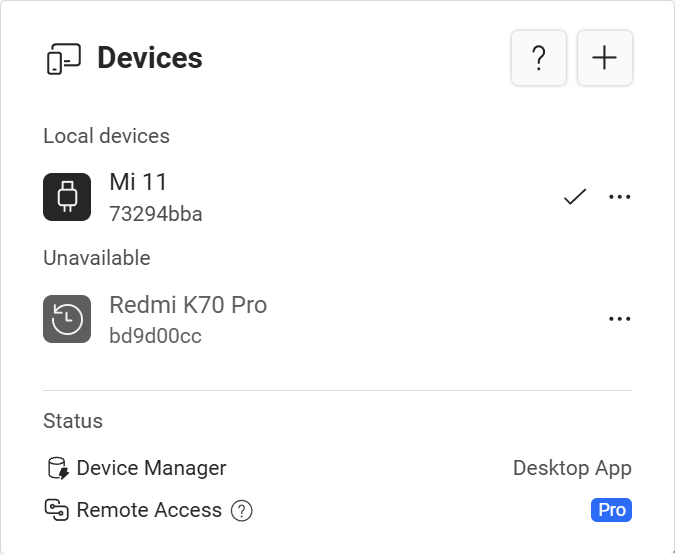

# Device management

import FluentAdd20Regular from '~icons/fluent/add-20-regular';

Due to security restrictions, Tango can't automatically detect devices connected to your computer. Devices need to be added one by one.

The first time you open Tango, you will see the instructions for pairing a device. From next time, if you open Tango with a device connected, it will automatically connect to that device.

## Pair another devices

If you have another device you want to use with Tango, follow these steps:

import ArrowSwap from './arrow-swap.svg';

* If Tango has already connected to a device, click the <ArrowSwap/> button on the top left corner, after the device name. Then click the <FluentAdd20Regular/> button.
* If you are on the **All devices are unavailable** page, click the **Add device** button.

Then follow the instructions on the screen to pair the device.

## List all paired devices

If multiple devices are available, Tango automatically connects to the most recently used device. You can view and switch between connected devices by clicking the <ArrowSwap/> button on the top left corner, after the device name.

There are several groups of devices:

### Local devices

These are devices that are currently connected to the computer and available for use. Tap on a device to switch to it.

### Unavailable devices

These are devices that are paired with Tango but are not currently connected. You can't switch to these devices until they are connected, but you can still un-pair them.

### Remote devices

import Pro from './_pro';

<Pro/>

These are devices that are connected to other Tango instances, and being [automatically shared](./remote-access/auto-share.mdx) to the current Tango instance. Tap on a device to switch to it.

### Team devices

<Pro team/>

These are devices that shared by other team members. Tap on a device to switch to it.

## Open a device in multiple tabs

Not available when running Tango on Android.

On computers, you can open multiple Tango tabs to use the same device.

This is useful when you want to use multiple features at once, for example, using the file browser to upload files while using the screen mirror to test the app.

## Use multiple devices at the same time

<Pro/>

With Pro plan, you can open up to 5 devices in multiple Tango tabs.

With Team plan, the number of devices is unlimited.

## Un-pair a device

import FluentDelete20Regular from '~icons/fluent/delete-20-regular';
import FluentMoreHorizontal20Regular from '~icons/fluent/more-horizontal-20-regular';

If you don't want to use a device with Tango anymore, you can un-pair it.

1. Tap the <ArrowSwap/> button on the top left corner, after the device name, to open the device list
2. Tap the <FluentMoreHorizontal20Regular/> button for the device you want to un-pair
3. Tap the <FluentDelete20Regular style={{verticalAlign:"middle",color:"red"}}/> **Remove** menu item.

You can't un-pair the device you are currently using. To un-pair it, first switch to another device (or switch to the pairing process), then un-pair it.
