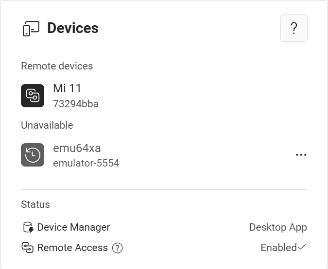

# Automatic device sharing

import Pro from '../_pro.tsx';

<Pro/>

With Pro or Team plan, you can automatically see and use your devices connected another computer, without manually creating share links.

## Share device

When a device is connected to Tango, it will be automatically shared to other computers signed into the same account. This list is sent securely, no one else can see your devices.

## Connect to shared device

When device A is connected to computer 1, and no device is connected to computer 2, and you have logged in the same account on both computers.

On computer 1 you can find device A normally. On computer 2, the device A can be found by:

* Tap the **Get Started** button on the home page.
* If the **Get Started** button takes you to the device paring page, tap the **Show paired devices** link below the **Next** button, then select device A from the list.
* If there is no **Show paired devices** link, wait for a few seconds as the device list loads. If the device list still doesn't show up, ensure that you have logged in with the same account on both computers.

In the device list, automatically shared devices will be in the **Remote devices** group.

Tap a device to connect to it remotely.

## Test it before purchasing

Automatic device sharing uses the same peer-to-peer connection as share by link. P2P connections generally doesn't work well in complex network environments, like double NAT.

If you are purchasing the Pro plan solely for this feature, you can check if it works for you by trying the [Share device by link](./share-link.mdx) feature first. If that works for you, the automatic device sharing feature should also work.
