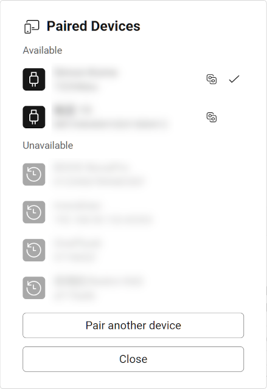

# Automatic device sharing

import Pro from '../_pro.tsx';

<Pro/>

When you log in to Tango on multiple computers, all devices connected to one computer will be automatically shared with other computers. This allows you to access and control the device from any computer without manually creating a sharing link.

## Share device

import ChannelShare from './channel-share.svg';

When a device is automatically shared, there will be a <ChannelShare/> icon in the device list:

## Connect to shared device

When device A is connected to computer 1, and no device is connected to computer 2, and you have logged in the same account on both computers.

On computer 1 you can find device A normally. On computer 2, the device A can be found by:

* Tap the **Get Started** button on the home page.
* If the **Get Started** button takes you to the device paring page, tap the **Show paired devices** link below the **Next** button, then select device A from the list.
* If there is no **Show paired devices** link, wait for a few seconds as the device list loads. If the device list still doesn't show up, ensure that you have logged in with the same account on both computers.

In the device list, automatically shared devices will be in the **Remote Devices** group, and have a <ChannelShare/> icon next to them.

import ArrowSwap from '../arrow-swap.svg';

When both computers have devices connected, opening Tango will automatically connect to the local device. To switch to a remote device, click the <ArrowSwap/> button on the top left corner, after the device name, then click the remote device you want to switch to.

## Test it before purchasing

Automatic device sharing uses the same peer-to-peer connection as share by link, and we can't guarantee it will work in every network environment.

If you are purchasing the Pro plan solely for this feature, you can check if it works for you by using the [Share Device By Link](./share-link.mdx) feature first. If the Share Device By Link feature works for you, the automatic device sharing feature should work as well.
