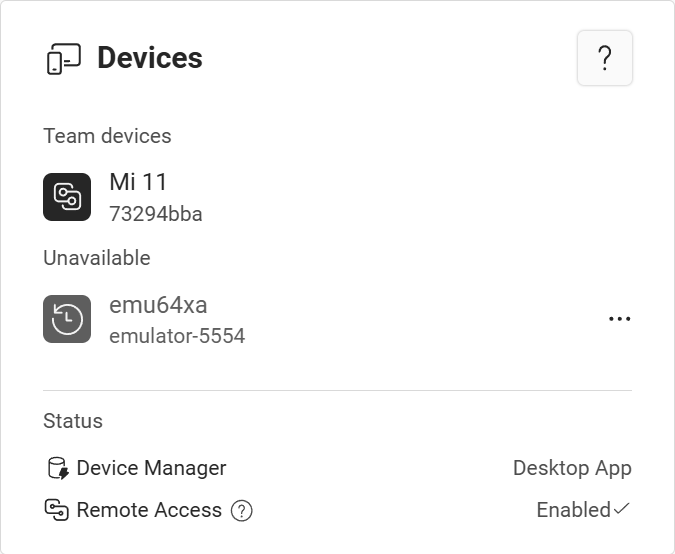
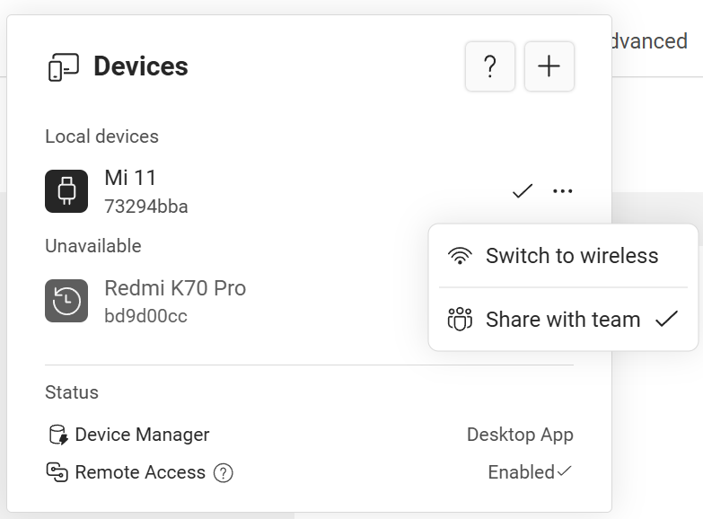

# Team device sharing

import Pro from '../_pro';

<Pro team/>

With team plan, you can automatically see and use all devices shared by all team members. This is similar to [automatic device sharing](./auto-share.mdx), but for all team members.

## Connect to team devices

When you or other team members have shared a device, it will be displayed in the **Team devices** group in device list:

Tap a device to connect to it remotely.

## Stop sharing devices with team

You can stop sharing specific device to team, by doing the following steps on the computer where the device is connected:

import FluentArrowSwap20Regular from '~icons/fluent/arrow-swap-20-regular';
import FluentMoreHorizontal20Regular from '~icons/fluent/more-horizontal-20-regular';
import FluentPeopleTeam20Regular from '~icons/fluent/people-team-20-regular';

1. Tap the <FluentArrowSwap20Regular/> button to open device list
2. Tap the <FluentMoreHorizontal20Regular/> button on the device you want to stop sharing to open the device menu
3. Uncheck <FluentPeopleTeam20Regular/> **Share with team** menu item.

After unchecking **Share with team**, this device is not visible to other team members, but still visible to yourself. You can still remotely access this device on other computers by signing into your account.

## Change device name

Device names in the list help differentiate each devices. You can change name name displayed in the list by either

* Change the device name in device Bluetooth setting page, then open it from the computer where the device is connected.
* Set a nickname from the [overview page](../features/overview.mdx#change-device-name), from the computer where the device is connected.
