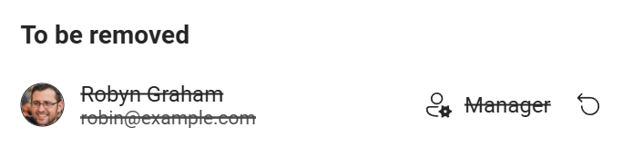

# Add or remove members

If you are a manager of your team, you can add new members to your team, or remove existing members from your team.

## Seat count

The number of seats is determined by how much you have been payed for the current billing cycle.

On the start of each billing cycle, the charged amount is determined by the member count, and the seat count will equal to the member count.

When you add members and pay for them, the seat count will increase.

When you remove members, the seat count will remain unchanged, allowing you to add another member to the team without paying.

When the next billing time arrive, the seat count resets to be equal to the member count.

## Open manage members dialog

You can find the **manage members** option from

1. Sign in to you account
2. Tap your profile icon on the top right
3. Tap **Settings**
4. In the **Team** section, tap the **Add or remove member** button

## Add members

Similar to creating team, you can enter the email address you want to add to the team.

If the email address is already associated with a user on Tango:

* If the user already have Pro plan, or if the user is already in a team, then you can't add them to your team.
* Otherwise, you will see the user's name, and you can add them to your team.

If the email address is not associated with any user on Tango:

* You can add this email address to your team, and when a user sign in with this email address, they will automatically join to your team.

### Pricing

If your team already have enough seats, those members will be added immediately. Otherwise, you need to pay for those new members, for the rest time of current billing cycle.

The remaining time of the billing cycle is calculated by subtracting the next billing time with current time, then rounding to the nearest whole day.

```
(Remaining days) = Round[(Next billing time) - (Current time)]
```

The daily price is calculated by dividing the price of one billing cycle, by the number of days in the current billing cycle, then rounding to 0.01 USD. The number of days will change for each month if payed monthly, or for leap years if payed annually.

```
(Daily price) = Round[(Billing cycle price) / (Days in current billing cycle), 0.01]
```

The final price for adding new members is calculated by multiplying the number of new seats, and the remaining days of the billing cycle, and the daily price for current billing cycle.

```
(Final price) = (Number of new seats) * (Remaining days) * (Daily price)
```

The price will be charged from current payment method. If the charge succeeds, those new members will be added to the team, and new seats will be added to the team for current billing cycle

## Remove members

import FluentDelete20Regular from '~icons/fluent/delete-20-regular';
import FluentArrowReset20Regular from '~icons/fluent/arrow-reset-20-regular';

Tap the <FluentDelete20Regular style={{verticalAlign:"middle",color:"red"}}/> **Remove** button to mark a member for removal. Billing manager who set the current payment method can't be removed.


Before confirming, tap the <FluentArrowReset20Regular/> **Undo remove** button to undo the removal.



Tap the **Save changes** button to confirm the removal.

Remove members from team will NOT refund the money for those members. Instead, removing members will leave empty seats for your team in the current billing cycle, allowing you to add another member to the team without paying.
